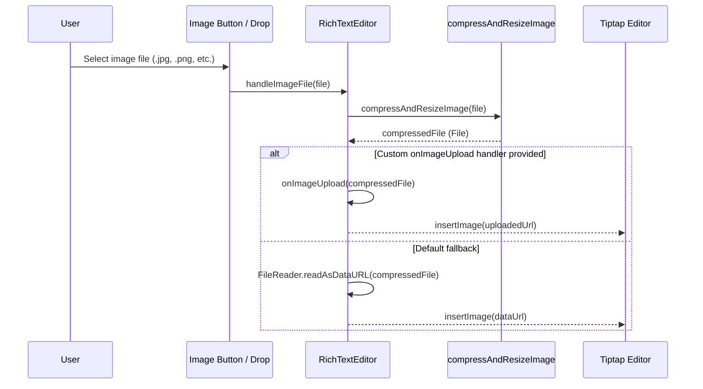

# DESIGN: Tiptap Editor Modes (Simple / Advance) & Image Upload

## 1. Overview & Architecture

The `RichTextEditor` component wrapper around `@tiptap/react` is extended to support a mode parameter:
- `mode?: 'simple' | 'advance'` (default `'simple'`)

```
+-------------------------------------------------------------------+
|                        RichTextEditor                             |
+-------------------------------------------------------------------+
| Mode: 'simple'                                                    |
| [Bold] [Italic] | [BulletList] [OrderedList]                      |
+-------------------------------------------------------------------+
| Mode: 'advance'                                                   |
| Row 1: [Undo] [Redo] | [H1] [H2] [H3] | [Bold] [Italic] [Underline]  |
|        [Strikethrough] [Code] | [BulletList] [OrderedList]        |
| Row 2: [Quote] [CodeBlock] [HR] | [AlignLeft] [AlignCenter]       |
|        [AlignRight] [AlignJustify] | [Link] [Image Upload]        |
+-------------------------------------------------------------------+
|                        Editor Content Area                        |
+-------------------------------------------------------------------+
```

## 2. Component Interface Specification

```typescript
export interface RichTextEditorProps {
  value: string
  onChange: (value: string) => void
  mode?: 'simple' | 'advance'
  editable?: boolean
  placeholder?: string
  className?: string
  onImageUpload?: (file: File) => Promise<string>
}
```

## 3. Extension Strategy

### Extensions loaded in 'simple' mode:
- `StarterKit` (includes Bold, Italic, BulletList, OrderedList, Paragraph, Document, Text, History, etc.)

### Extensions loaded in 'advance' mode:
- `StarterKit`
- `Underline` (`@tiptap/extension-underline`)
- `TextAlign.configure({ types: ['heading', 'paragraph'] })` (`@tiptap/extension-text-align`)
- `Link.configure({ openOnClick: false, HTMLAttributes: { class: 'text-primary underline' } })` (`@tiptap/extension-link`)
- `Image.configure({ HTMLAttributes: { class: 'max-w-full h-auto rounded-md my-2' } })` (`@tiptap/extension-image`)

## 4. Image Upload & Auto-Compression Flow



## 5. UI & Styling

- Toolbar buttons use `<Toggle>` from `~/components/ui/toggle` or `<Button>` from `~/components/ui/button`.
- Dividers between button groups use `<Separator orientation="vertical" className="h-5 mx-1" />` or standard `div` borders.
- Responsive wrapping: Toolbar items use `flex flex-wrap items-center gap-1 p-1.5 border-b bg-muted/30`.
- Editor content area styled with `prose dark:prose-invert max-w-none min-h-32 p-3 text-sm focus:outline-none`.

## 6. Testing Strategy

1. **Unit tests (`src/components/custom/richtext-editor.test.tsx`)**:
   - Verify `mode="simple"` renders standard 4 toolbar buttons (Bold, Italic, Bullet List, Ordered List).
   - Verify `mode="advance"` renders additional toolbar buttons (Headings, Underline, Code block, Alignment, Link, Image, Undo, Redo).
   - Mock `@tiptap/extension-image`, `@tiptap/extension-link`, `@tiptap/extension-underline`, `@tiptap/extension-text-align`.
   - Test image file input triggers `compressAndResizeImage` and calls `setImage` command or `onImageUpload`.
   - Test backward compatibility: omitting `mode` defaults to `'simple'`.
